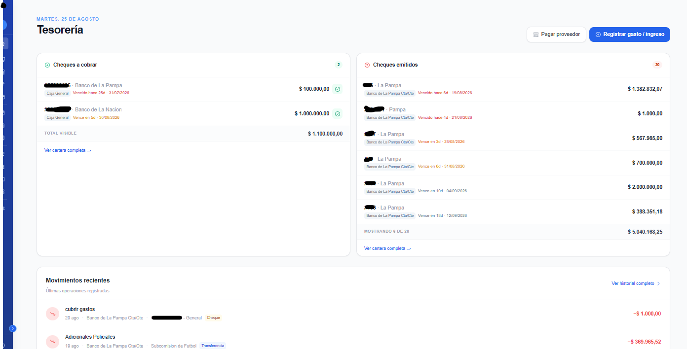
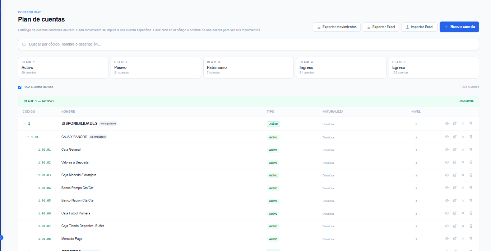
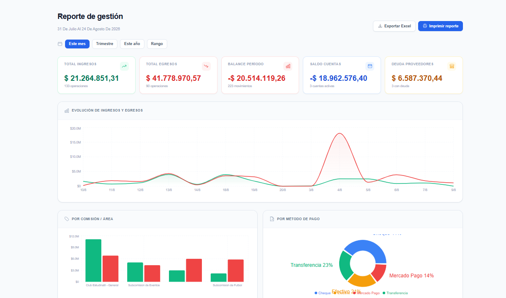
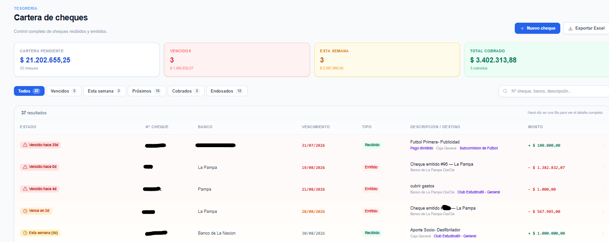

# Treasury & Accounting System — Case Study

A double-entry accounting and treasury management system built for a sports
club in Argentina. Handles the full cycle: cash and bank positions, supplier
payments, cheque lifecycle including endorsement, and automatic journal entries
against a 300-account chart of accounts.

> **Case study only.** The source code is private — the system runs in
> production and handles the club's real financial records. Happy to walk
> through the codebase or give access to a demo environment on request:
> [fpatrilla@gmail.com](mailto:fpatrilla@gmail.com)

---

## Screenshots

| Dashboard | Chart of accounts |
|---|---|
|  |  |

| Financial reports | Cheque management |
|---|---|
|  |  |

---

## Stack

| | |
|---|---|
| **Framework** | Next.js 14 (App Router) |
| **Language** | TypeScript |
| **Database** | MongoDB / Mongoose |
| **Styling** | Tailwind CSS |
| **Charts** | Recharts |
| **Exports** | ExcelJS |
| **Deployment** | Vercel |

---

## The problem

The club was tracking its finances across spreadsheets and paper. Treasurers
change with each administration, cheques circulate between suppliers, and the
accountant needs a general journal that actually balances. The system had to
serve two audiences at once: volunteers registering a payment in thirty
seconds, and an accountant who expects proper double-entry bookkeeping.

That constraint shaped every design decision below.

---

## Core features

### Double-entry bookkeeping

- Hierarchical chart of accounts (3 levels, 300+ accounts) following the
  client's own accounting plan, with an `imputable` flag separating aggregator
  accounts from those that can actually receive entries
- Journal entries generated automatically from every registered movement — the
  operator books a payment, the accounting layer records the debit and credit
- Manual journal entries for adjustments, with cash-impact detection: automatic
  when the account maps to a single cash box, prompted when it maps to several,
  fully manual when there's no link at all
- General journal with date-range filtering and PIN-protected reallocation of
  individual entry lines
- Excel import and export of the full chart of accounts, for migration and
  for the accountant's own workflow

### Reporting

- Period-filtered reports across accounts, movements and cheque position
- Per-account detail breaking down every movement, its payment method, linked
  cheques and the journal entry it generated
- Charts for income and expense composition (Recharts)
- Excel export on every report, plus a print-oriented view — the treasury
  still has to hand a paper report to the club's board each month
- Cash count (arqueo) computing the current position, distinguishing cheques
  pending collection from cheques issued

### Cheque lifecycle

Cheques are the hardest part of the domain and got the most attention:

- Multiple cheques per transaction, each an independent subdocument with its
  own amount, due date and status
- **Endorsement** — a cheque received from a member can be handed to a supplier
  as payment, keeping the trace back to its origin transaction
- Portfolio view with urgency-based colour coding by due date, tabbed by status
- Excel export split across tabs: summary, overdue, cashed, endorsed, issued
- Cheques load through the same movement endpoint as every other payment
  method, so they inherit all existing reporting and listing logic

### Treasury

- Multiple cash boxes and digital wallets, with payment methods constrained by
  account type — a physical cash box only accepts cash or cheque, a digital
  wallet only transfers
- Supplier registry with payment history and outstanding balances
- Sequential receipt numbering with a dedicated endpoint, so numbering stays
  correlative across concurrent users in different locations
- Printable receipts with the club's letterhead

---

## Engineering notes

**Cheques as subdocuments, not a collection.** The first design gave cheques
their own collection and parallel API. That meant every existing feature —
reporting, listings, marking as cashed — needed a second code path. Folding
them into the transaction as an array of subdocuments meant one circuit
instead of two. Individual cheques are addressed by a composite
`transactionId:chequeId` identifier, which keeps operations targetable without
a separate lookup.

**Timezone correctness on serverless.** Vercel runs in UTC; the club operates
in Argentina. A movement registered at 9 PM local time was landing on the next
day's report. Every date filter now uses an explicit `-03:00` offset rather
than relying on the runtime's clock — a bug that only appears in production
and looks like data loss to the user.

**Two-stage PIN verification.** Sensitive operations — reallocating an entry,
deleting an account — check the PIN client-side first for immediate feedback,
then revalidate server-side before persisting. The client check is a courtesy;
the server check is the actual control.

**Backward-compatible flags.** The `imputable` field was added after accounts
already existed. Filtering on `imputable !== false` rather than
`imputable === true` treats legacy records as valid instead of silently hiding
them — a small choice that avoided a migration.

**Model registration on serverless.** Mongoose models weren't consistently
registered across cold starts, breaking populated queries intermittently. A
barrel file imported from the connection module forces registration before any
query runs.

---

## Author

**Federico Patrilla** — Full Stack Developer
TypeScript · Next.js · Node · MongoDB

[LinkedIn](https://linkedin.com/in/federico-patrilla) ·
[GitHub](https://github.com/fpatrilla) ·
fpatrilla@gmail.com